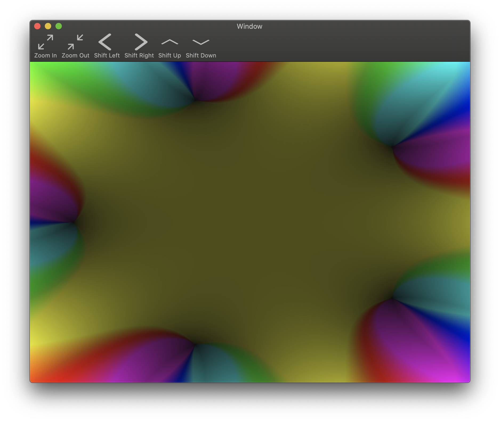
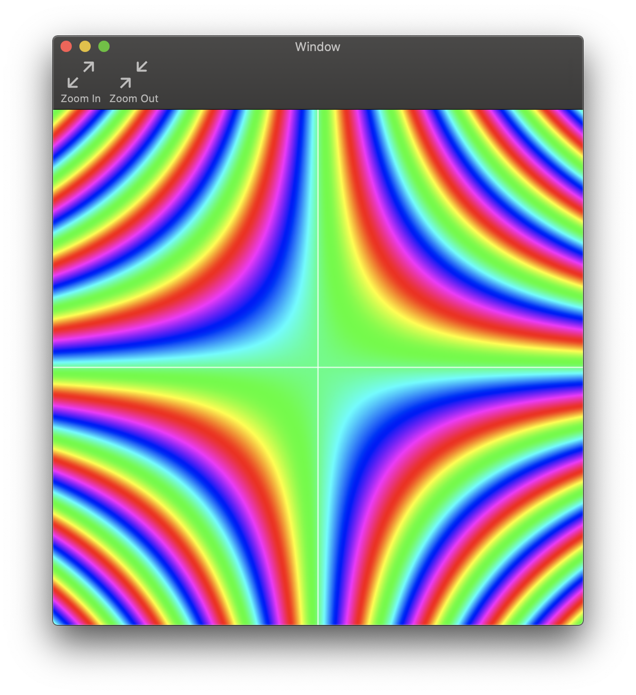
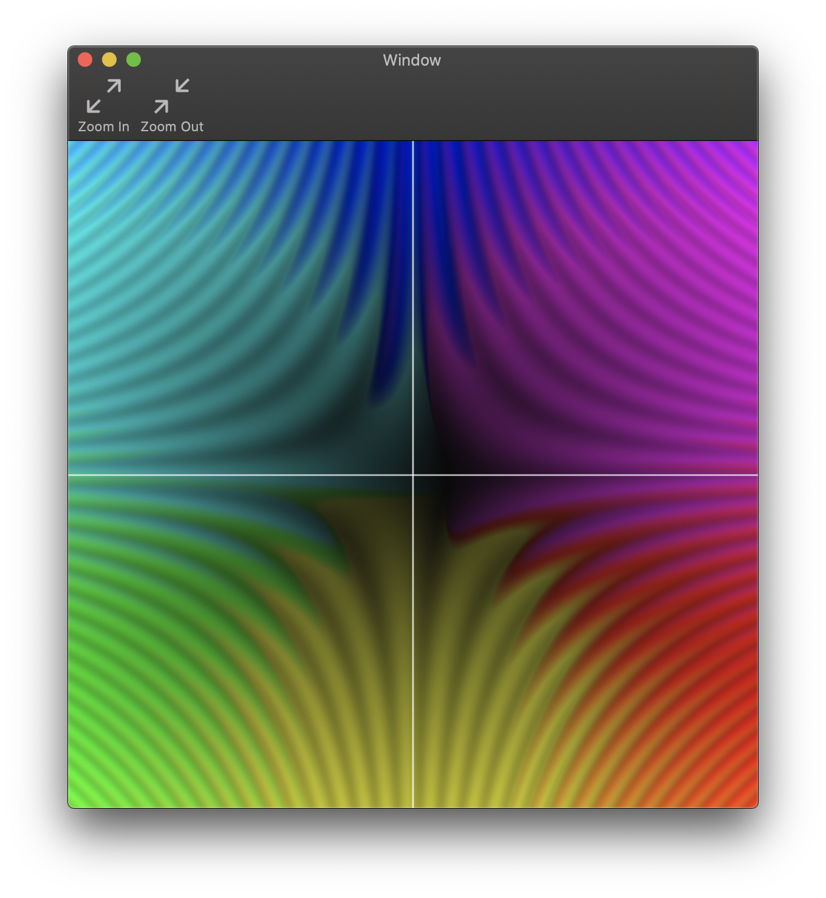

# Function-Visualizer
iOS/iPad OS/macOS tool for visualizing complex functions, or any function that maps a 2D field to another.

This visualization method is based on [this video by 3Blue1Brown.](https://www.youtube.com/watch?v=b7FxPsqfkOY)

## What is this thing?

Great question! This is a tool that visualizes functions mapping a two dimensional plane to another two dimensional plane. This could be R2 -> R2, or C -> C.

### Notation

I'm not sure if there's already a convention for these sorts of functions, but I'm going to say that "(x,y) -> ( f(x), g(y) )" denotes a function that maps a point (x, y) to the point ( f(x), g(y) ) where f and g map R -> R.

### Visualization method

As said before, I'm going based off the 3b1b video, but here is a brief summary. Each "output point" is treated as a vector. The final "graph" of the function will be a plane where every point's color represents its output point. The "colors" of these output points are determined as follows:

1. Overlay the output point as a vector over a hue circle. Whichever hue it points to is the hue of this point.
2. The brightness of the point is determined by the magnitude of the vector (higher magnitude means a more intense color)
3. Do this for every point on the output plane

## Here are some pretty examples! (and some interesting properties I noticed)

Shown below is the graph of the complex function f(z) = z^5. You can even see its complex roots as the black spots! How cool is that?

For this next one, I'm afraid I didn't record the function I entered (unfortunate, since this graph is cool) but I noticed that the pattern below is commonly found in nature in two circumstances. 1) as a moire pattern when two grids interfere (try holding your phone camera up to your phone screen to see it) and 2) whenever I hold my grid-woven placemet up behind the water in my glass, and the grid is distorted. I'm fascinated as to what the connection here is!

This next one is the same function as above, but I did something different and quirky for fun. Instead of graphing the output plane, I took every output vector and subtracted the input vector to get what I call the "change vector," and graphed the colors for the change vectors instead:

